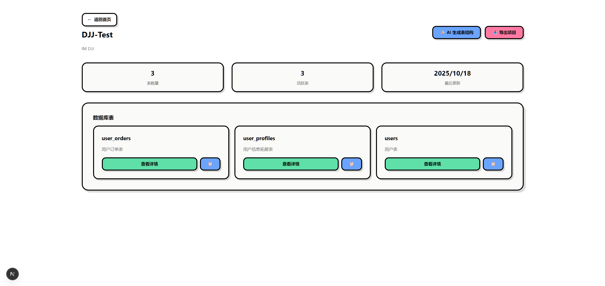
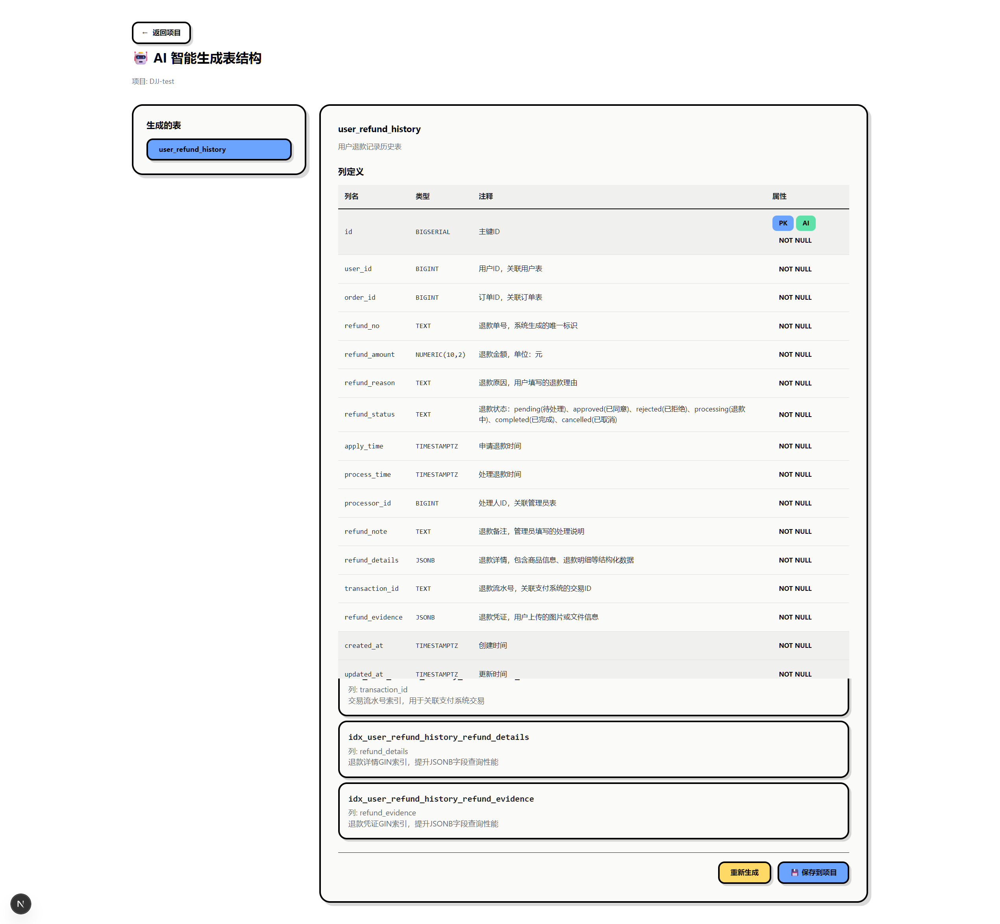

# Schemart

AI 驱动的数据库表结构设计与管理工具。

## 下载与安装

```bash
git clone https://github.com/TokenRollAI/schemart.git
cd schemart
pnpm install
```

## 使用

1. 复制环境变量示例并配置至少一个 AI 提供商的密钥
   ```bash
   cp .env.example .env.local
   ```
2. 初始化数据库
   ```bash
   pnpm db:push
   ```
3. 启动开发服务器
   ```bash
   pnpm dev
   ```
4. 打开浏览器访问 `http://localhost:3000`。

如需生产部署可运行 `pnpm build && pnpm start`。

## 效果展示






